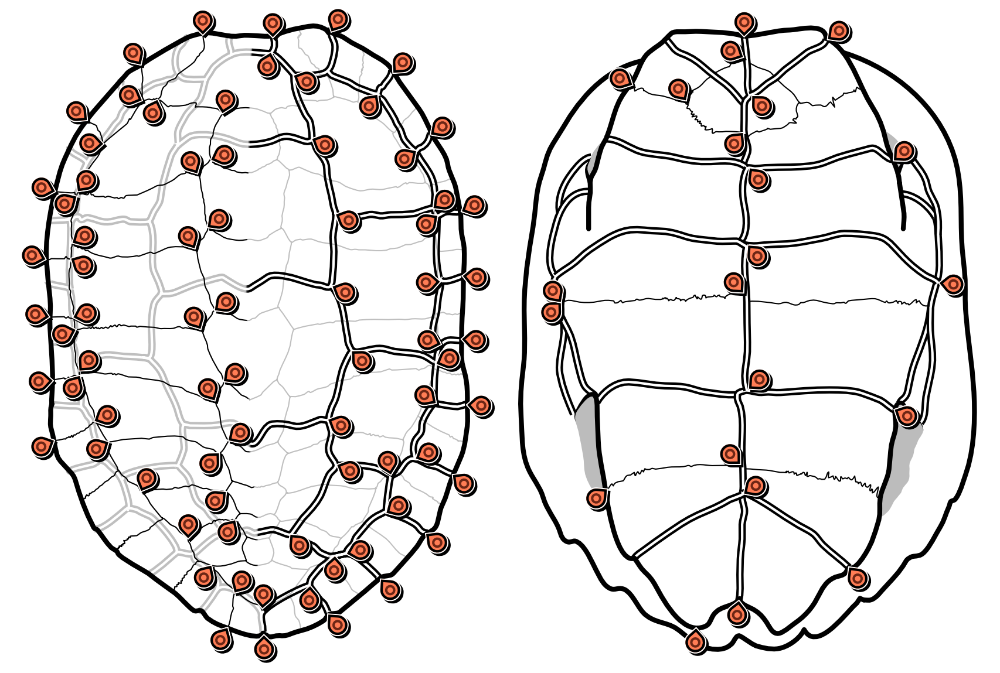

# shell_landmarks

3D landmarks of bone plates and sulci of the shells of geoemydid turtles, and a few other testudinoids.

Please cite the paper where this data was first published:

Ascarrunz, E., Claude, J., & Joyce, W. G. (2019). Estimating the phylogeny of geoemydid turtles (Cryptodira) from landmark data: An assessment of different methods. PeerJ, 7, e7476. [https://doi.org/10.7717/peerj.7476](https://doi.org/10.7717/peerj.7476)

This is what you will find in the `data` directory:

| File                                                                | Content                                           |
| :------------------------------------------------------------------ | ------------------------------------------------- |
| [specimens.csv](data/specimens.csv)                                 | Collection data about the specimens               |
| [landmark_definitions_cara.txt](data/landmark_definitions_cara.txt) | Definition of the landmark points on the carapace |
| [landmark_definitions_plas.txt](data/landmark_definitions_plas.txt) | Definition of the landmark points on the plastron |
| [carapace.tps](data/carapace.tps)                                   | Carapace landmark data                            |
| [plastron.tps](data/plastron.tps)                                   | Plastron landmark data                            |

In the TPS files, each specimen is referred to by its collection number, and replicate measurements of the same specimen are indicated by the character '$' followed by the letter 'a' or 'b'.

This work is licensed under a [Creative Commons Attribution 4.0 International License](http://creativecommons.org/licenses/by/4.0/).